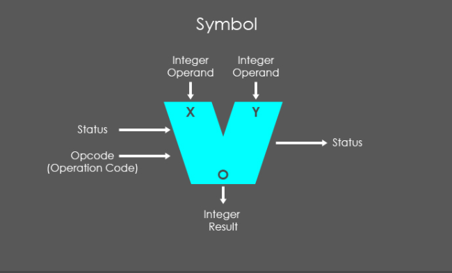
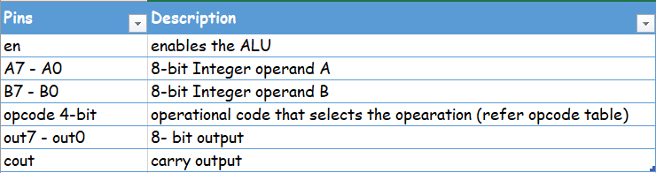
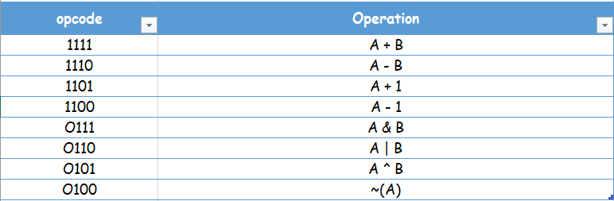
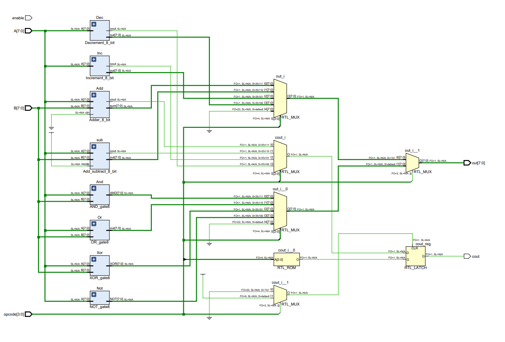
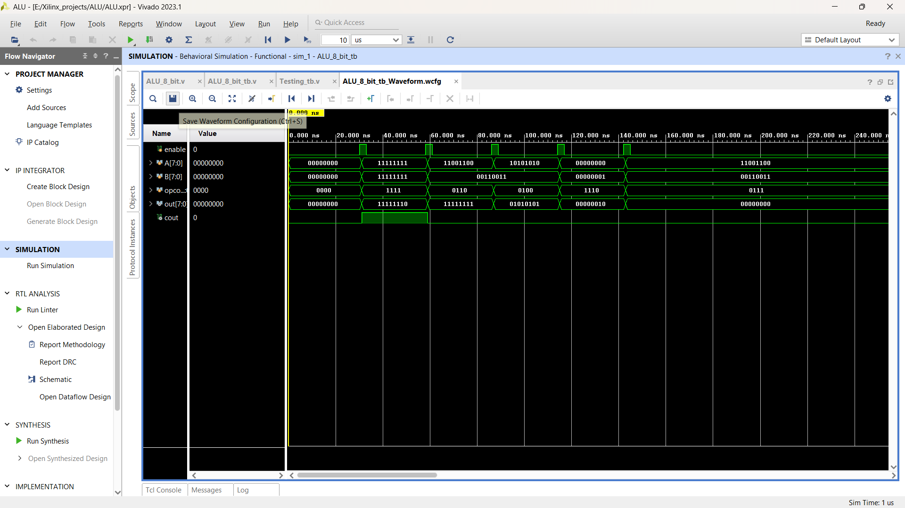

# Design & Verify 8-bit ALU.

## Introduction
ALU performs arithmetic and logic operations. It is also one of the most fundamental units of many computing circuits, including the central processing unit (CPU) of computers, and the graphic processing unit (GPU) of video cards.

In this repo you can find independent modules that can perform 8-bit arithmetic operations like `ADDITION`, `SUBTRACTION` and logic operations like `AND`, `OR`, `XOR`. In the end all integrate to form an `ALU`.

    

Inputs of an ALU are primarily the operands which are the data to be operated on. In addition, an ALU has opcodes as inputs to control the type of operation the ALU shall perform.

## Pin description  

    

## Opcodes  

    

## Internal View Of ALU  

[PDF File](schematic.pdf)

    

## Output

Output generated using [testbench](ALU_Waveform.png)

    

